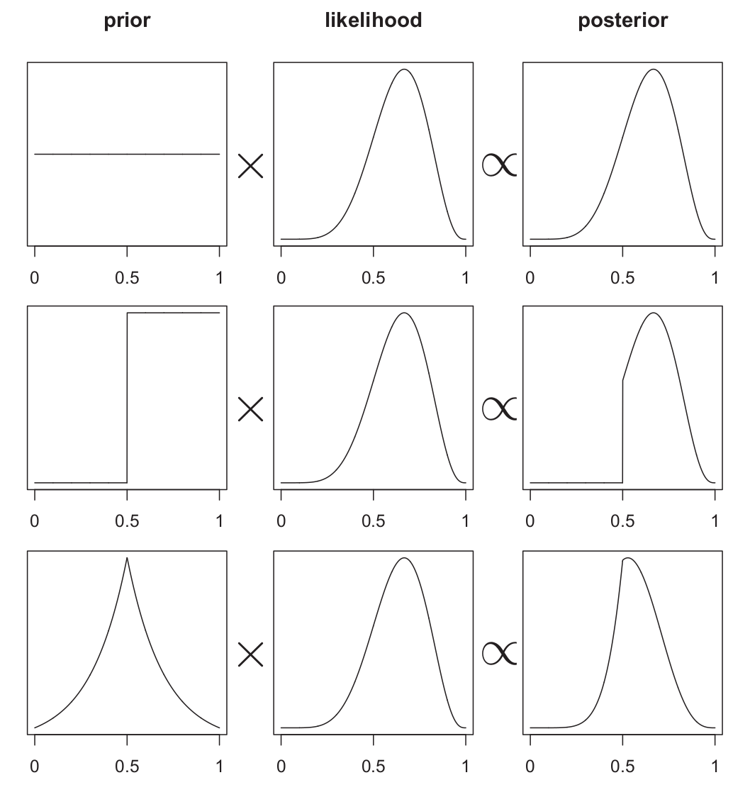

```{r setup, include=FALSE}
knitr::opts_chunk$set(echo = TRUE,
                      comment = NA)
```


```{r load-libraries, echo=TRUE, results='hide', message=FALSE}
# box loads specific packages+functions into the namespace (similar to Python's import)
box::use(
  rstan[...],
  rstanarm[stan_glm, normal],
  dplyr[...],
  tidyr[...],
  ggplot2[...],
  bayesplot[...],
  magrittr[`%>%`]
)

# rstan has a startup message recommending to set these two options
options(mc.cores = parallel::detectCores())
rstan_options(auto_write = TRUE)
```


# Intro to Bayes

* What is the most likely distribution of a parameter given the data and prior knowledge (or beliefs)
* The posterior is proportional to the prior times the likelihood
* $\mathrm{posterior} \propto \mathrm{prior} \times \mathrm{likelihood}$
* $\pi(\theta | \mathrm{data}) \propto \pi(\theta) \times \pi(\mathrm{data} | \theta)$
* The denominator in Bayes' Theorem is often too complex to solve analytically
  * Approximation techniques like Markov Chain Monte Carlo (MCMC) are used to estimate the denominator
  * Smarter sampling can be done to draw samples directly from the posterior

```{r prior-times-lik-fig, echo=FALSE, fig.cap="The posterior distribution as a product of the prior distribution times the likelihood. Image from Statistical Rethinking by Richard McElreath."}

```


## Basics of Hamiltonian Monte Carlo

* A massless particle is imparted with random velocity (speed + direction)
* http://chi-feng.github.io/mcmc-demo/app.html
* Adaptive parameters are learned during the warmup sampling phase
  * step size, momentum
* Compared to Gibbs Sampling
  * HMC generally has reduced autocorrelation between successive samples
  * All parameters are updated at the same time
  * The "warmup" period is not "burn-in"
  * Divergent transitions for diagnostics
  * Stan complains more, which is a good thing
  
## Limitations of HMC

* simulating the path of a particle requires smooth gradients

# Simple Linear Regression

The simplest linear regression model is the following, with a single predictor and a slope and intercept coefficient, and normally distributed noise. This model can be written using standard regression notation as

$$
y = \alpha + \beta x + \epsilon \quad \mathrm{where} \quad \epsilon \sim \mathcal{N}(0, \sigma)
$$

We can re-write the above in an equivalent form

$$
y - (\alpha + \beta x) \sim \mathcal{N}(0, \sigma) \Longleftrightarrow y \sim \mathcal{N}(\alpha + \beta x, \sigma)
$$

## Data

```{r load-synth-data}
load("../data/simple_linear_model.rda")
str(simple_linear_model)
ggplot(simple_linear_model, aes(x, y)) + 
  geom_point()
```

## Model Fitting

### Frequentist

```{r base-slm}
lm(y ~ 1 + x, data = simple_linear_model) %>% 
  summary()
```

* We get an estimate for each parameter
* We get the standard error in the estimates
* *Confidence* intervals can be constructed

### Bayesian using `rstanarm`

`rstanarm` is an easy to use replacement for standard `R`'s `lm` and `glm`. It uses pre-compiled Stan programs in the backend, so it is fast to use and fast to sample.

**Setting weakly informative priors manually**

```{r rstanarm-slm}
slm <- stan_glm(y ~ 1 + x, family = gaussian(link = "identity"), 
                data = simple_linear_model,
                prior = normal(0, 1),
                prior_intercept = normal(0, 1),
                # set refresh=0 to hide sampling progress
                refresh = 100)

summary(object = slm, digits = 3)
```

* Get an estimate for each parameter
* Get standard deviations of the posterior distribution for each parameter
* Have posterior samples to construct *credible* intervals

```{r slm-extract-post-rstanarm}
post <- as.data.frame(slm)
str(post)
```

* Can use the posterior samples to construct all kinds of summary stats
  * median
  * highest density posterior intervals

```{r slm-plot-post-hist}
post %>%
  select(`(Intercept)`, x) %>%
  pivot_longer(all_of(1:2), names_to = "par", values_to = "val") %>%
  mutate(par = factor(par)) %>%
  ggplot(aes(val, ..density..)) +
  geom_histogram(bins=50) +
  facet_wrap(~ par, scales = "free")
```

```{r}
hist(-post$x / post$`(Intercept)`)
```


* Can use the posterior to plot a handful of sample curves

```{r slm-plot-post-samples}
n <- 100
idx <- sample(1:nrow(post), size = n, replace = TRUE)
a <- post$`(Intercept)`[idx]
b <- post$x[idx]

plot(y ~ x, pch = 16, data = simple_linear_model)
for (i in 1:n) {
  abline(a = a[i], b = b[i], col = rgb(0,0,0,0.1))
}
```

**setting more informative priors**

```{r slm-ex1, eval=FALSE}
# Not run
stan_glm(y ~ x, family = gaussian(link = "identity"), 
         data = simple_linear_model,
         prior = normal(2, 1),
         prior_intercept = normal(1, 1),
         refresh = 0)
```


**Letting Stan adaptively set priors and transform data**

```{r slm-ex2, eval=FALSE}
# Not run
stan_glm(y ~ x, family = gaussian(link = "identity"), 
         data = simple_linear_model,
         refresh = 0)
```


### Bayesian using Stan (`rstan`)

**Writing the model**

* three essential "blocks" to every Stan program
  * data
  * parameters
  * model
* other blocks
  * functions
  * transformed data
  * transformed parameters
  * generated quantities
* full details: https://mc-stan.org/docs/2_26/reference-manual/blocks-chapter.html
* Can implement "robust" regression
  * error terms don't need to be assumed to be normally distributed
  * can use student-T


```{stan slm-model, output.var="slm_stan"}
data {
  int N;       // number of observations
  vector[N] y; // outcome
  vector[N] x; // predictor
}

parameters {
  real intercept;
  real slope;
  real<lower=0> sigma;
}

model {
  // Priors
  intercept ~ normal(0, 1);
  slope ~ normal(0, 1);
  sigma ~ exponential(1);
  
  // Likelihood
  y ~ normal(intercept + slope*x, sigma);
}
```

**Preparing the Data**

```{r slm-data-prep}
dat <- list(
  N = nrow(simple_linear_model),
  x = simple_linear_model$x,
  y = simple_linear_model$y
)
```


**Running the Model**

```{r slm-fit-stan}
stan_lm_fit <- sampling(slm_stan, data = dat)
```


**Extracting samples**

```{r slm-extract-stan}
lm_post <- rstan::extract(stan_lm_fit)
str(lm_post)
```


# Real-world data: New York Air Quality

```{r load-aq-data}
data("airquality")
str(airquality)
```

**Prepare Data**

```{r aq-prep}
dat <- airquality %>%
  select(Ozone, Temp) %>%
  drop_na()

str(dat)
```

```{r}
plot(Ozone ~ Temp, data = dat)
```


### Frequentist

```{r base-poiss}
glm(Ozone ~ 1 + Temp, data = dat,
    family = poisson(link = "log")) %>% summary()
```

### Bayes using `rstanarm`

```{r rstanarm-poiss}
prm <- stan_glm(Ozone ~ 1 + Temp, data = dat, 
                family = poisson(link = "log"))

summary(object = prm, digits = 3)
```


### Bayes using `rstan`

> Poisson regression assumes the response variable Y has a Poisson distribution, and assumes the logarithm of its expected value can be modeled by a linear combination of unknown parameters.

$$
\begin{align}
Ozone &\sim \mathrm{Poisson}(\lambda) \\
\log(\lambda) &= \alpha + \beta \cdot Temp
\end{align}
$$

**Writing the program**

```{stan poisson-model, output.var="poisson_stan"}
data {
  int N;
  vector[N] Temp;
  int Ozone[N];
}

parameters {
  real a;
  real b;
}

model {
  // Priors
  a ~ normal(0, 100);
  b ~ normal(0, 100);
  
  // likelihood
  Ozone ~ poisson_log(a + b*Temp);
}
```


**Preparing the Data**

```{r poiss-data-prep}
dat_aq <- list(
  N = nrow(dat),
  Temp = as.numeric(dat$Temp),
  Ozone = as.integer(dat$Ozone)
)
```


**Running the Model**

```{r poiss-fit-stan}
stan_poiss_fit <- sampling(poisson_stan, data = dat_aq,
                           cores = 4, refresh = 0)
```


**Extracting samples**

```{r poiss-extract-post}
poiss_post <- rstan::extract(stan_poiss_fit)
str(poiss_post)
```


---

# Further Resources

* Excellent textbook: Statistical Rethinking 2nd Edition by Richard McElreath
  * Lecture videos: https://www.youtube.com/playlist?list=PLDcUM9US4XdNM4Edgs7weiyIguLSToZRI
  * Lecture homework: https://github.com/rmcelreath/stat_rethinking_2020
  * Corresponding R package: https://github.com/rmcelreath/rethinking/
* Stan Documentation
  * Reference manual: https://mc-stan.org/docs/2_26/reference-manual/index.html
  * User's guide: https://mc-stan.org/docs/2_26/stan-users-guide/index.html
* In depth tutorial
  * *Towards a Principled Bayesian Workflow*, by Michael Betancourt
  * https://betanalpha.github.io/assets/case_studies/principled_bayesian_workflow.html
* Anything by Andrew Gelmen
